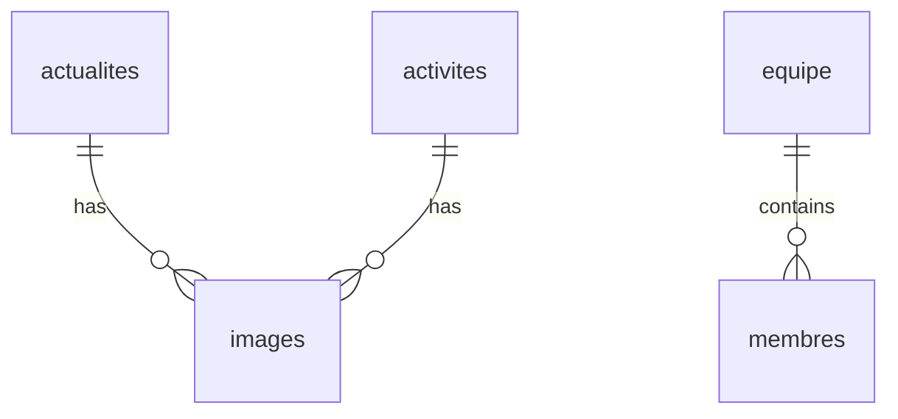

# Documentation Technique - AjialAlAtlas

## Vue d'ensemble

AjialAlAtlas est un site web dynamique pour une école, développé avec PHP et MySQL. Il comprend une partie publique pour les visiteurs et un panneau d'administration sécurisé.

## Structure des dossiers

```
AjialAlAtlas/
├── assets/            # Ressources statiques (images, CSS, JS)
├── backend/          
│   ├── admin/        # Pages d'administration
│   └── includes/     # Composants réutilisables
└── database.sql      # Structure de la base de données
```

## Prérequis

- PHP 7.4+
- MySQL 5.7+
- Apache 2.4+
- Extensions PHP requises:
  - PDO
  - PDO_MYSQL
  - GD

## Installation

1. Cloner le dépôt dans le dossier `htdocs` de XAMPP
2. Créer une base de données MySQL nommée `ajialatlas`
3. Importer le fichier `database.sql`
4. Configurer les accès base de données dans `backend/includes/db.php`
5. Accéder à l'administration via `/admin/login.php`
   - Identifiants par défaut: 
     - Utilisateur: admin
     - Mot de passe: admin123

## Base de données

### Tables principales

- `actualites` - Gestion des actualités
- `activites` - Activités parascolaires
- `equipe` - Membres de l'équipe
- `contact_messages` - Messages du formulaire de contact
- `statistics` - Statistiques affichées
- `carousel_items` - Éléments du carrousel

### Relations



## Points d'API

### Publique

- `GET /activites.php` - Liste des activités
- `GET /actualites.php` - Liste des actualités
- `POST /process_contact.php` - Envoi de message de contact

### Administration

- `/admin/login.php` - Authentification
- `/admin/manage-*.php` - CRUD des différentes sections

## Sécurité

1. Protection contre les injections SQL via PDO
2. Validation des fichiers uploadés
3. Sessions sécurisées
4. Protection CSRF sur les formulaires
5. Échappement des données HTML

## Fonctionnalités principales

### Frontend

- Navigation responsive
- Carrousel dynamique
- Formulaire de contact
- Galerie d'images
- Pages de contenu dynamiques

### Backend

- Tableau de bord administrateur
- Gestion des utilisateurs
- CRUD complet pour chaque section
- Upload d'images sécurisé
- Éditeur de contenu riche

## Notes de développement

1. Utiliser `htmlspecialchars()` pour l'affichage des données
2. Valider tous les inputs utilisateur
3. Maintenir les clés étrangères pour l'intégrité
4. Optimiser les images uploadées
5. Mettre en cache les requêtes fréquentes

## Support

Contact technique : [contact@ajialatlas.ma]
